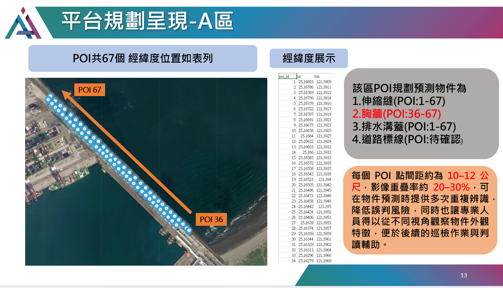
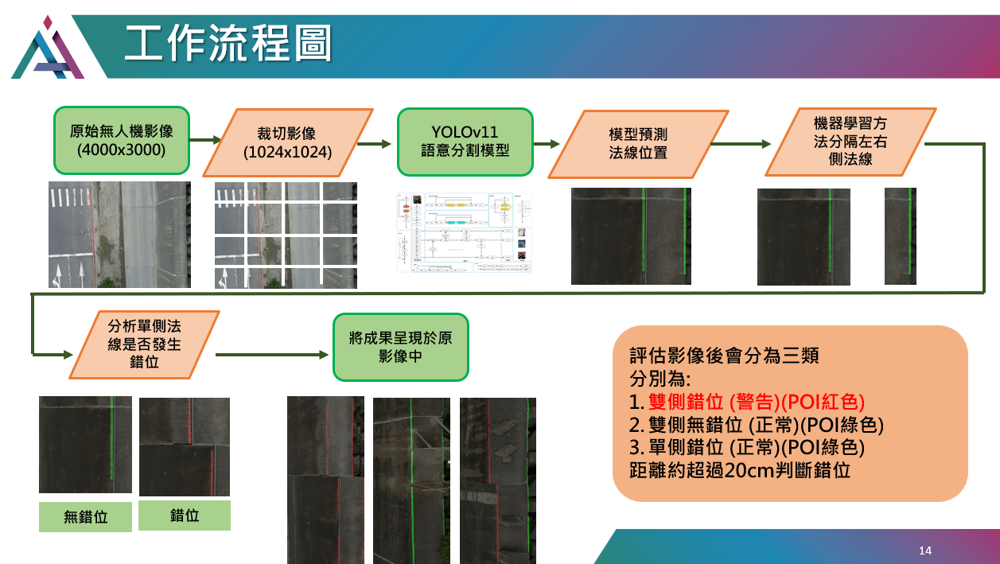

# Normal Detection - Dockerized Inference

本專案提供港區平台設施的自動化缺陷檢測，結合 UAV 影像與深度學習模型。支援 GPU 部署（CUDA 12.4），可一鍵復現分析流程。

**⚠️ 本專案同時支援 GPU 與 CPU 執行！**
- 若顯卡支援 CUDA 12.4，直接使用 Docker 指令即可 GPU 加速。
- **若沒有 NVIDIA GPU，也能在 CPU 上執行，只需將 Docker 指令移除 `--gpus all` 參數即可（效能較低但能正確推論）。**

---

## 📍 平台規劃說明



- 本區共設置 31 個 POI（定位點），經緯度如表所示。
- 預測對象：
  胸牆 (POI: 36–67)

---

## 🛠️ 工作流程



1. 無人機拍攝原始影像（4000x3000）。
2. 影像切割成 1024x1024 塊。
3. 使用 YOLOv11 語意分割模型預測法線位置。
4. 法線定位後，進行左右側線分類、錯位判斷。
5. 結果標記於原影像，並依據錯位/無錯位分級。

### 評估結果分為三類：
- **雙側錯位（警告）(POI紅色)**
- **雙側無錯位（正常）(POI綠色)**
- **單側錯位（正常）(POI綠色)**
- 距離約超過 20cm 判斷斷錯位

---

## ⚙️ 部署說明（Docker + CUDA 12.4）

### 1. 拉取 CUDA 12.4 image
```bash
docker pull nvidia/cuda:12.4.1-cudnn-devel-ubuntu22.04
```

### 2. 建立 image
```bash
docker build -t normal-detection:cuda12.4 .
```

### 3.1 執行 container(支援CUDA12.4)
```bash
docker run --gpus all -it --name normal-detection-container ^
  -v D:/normal_detection:/app ^
  -w /app ^
  normal-detection:cuda12.4
```

- `-v`：掛載本機專案資料夾(自訂資料夾路徑)    
- `-w`：設置工作目錄  
- 預設會執行 `main.py`，推論結果會輸出到 `/app/output/`（本機 output 資料夾）

---
### 3.2 執行 container(使用CPU推論)
```bash
docker run -it --name normal-detection-container ^
  -v D:/normal_detection:/app ^
  -w /app ^
  normal-detection:cuda12.4
```
- `-v`：掛載本機專案資料夾(自訂資料夾路徑)  
- `-w`：設置工作目錄  
- 預設會執行 `main.py`，推論結果會輸出到 `/app/output/`（本機 output 資料夾）

---

## 📂 目錄結構

```
input/      # 原始影像
models/     # 模型檔案
output/     # 預測結果
utils/      # 輔助腳本
Dockerfile  # Docker 設定
main.py     # 主程式
requirements.txt
README.md
platform_poi.png
workflow.png
```

---

## 📢 注意事項

- 若無 GPU/驅動，container 會自動 fallback 至 CPU（需程式支援）。
- 如需在其他路徑運行，請調整 `-v` 掛載參數。

---

## 📝 作者

- [xc6571260](https://github.com/xc6571260)

## 聯絡方式
- r12521801@ntu.edu.tw
